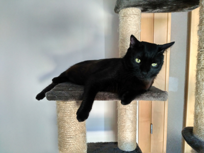
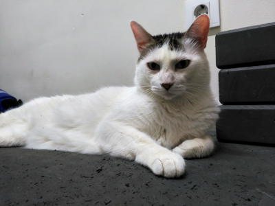

This model try to detect my cats and check who is who in an image  using the pre-trained model Xception.

The videos from where I extracted the images can be downloaded from [here][1] (1 GB)

The data used for training, validate and test can be downloaded from 
[here][2] (338 MB). Extract files into <em>data</em> folder

[1]: https://drive.google.com/file/d/1XQDWcHzNAgqlHcUUfETD9hF9B0gzAmEf/view?usp=sharing

[2]: https://drive.google.com/file/d/1F7WtZKd5jt3-99bl-PBfwdBOj1ArbCbj/view?usp=sharing