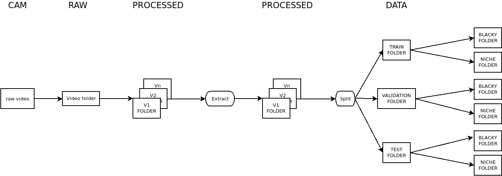

# Data collection and processing #

## Data Collection ##

- All videos from camera goes to <em>raw/video</em> folder
- Named as v1, v2... v<em>n</em>
- New videos named as v<em>n</em>+1

## Video processing ##

- The video to be processed will be copied into <em>data/processed/vn</em>, where v<em>n</em> is the same name of the video.
- Use <em>tools/extractor.py</em> script to extract the images from the video in the same folder v<em>n</em>
- Use <em>tools/copy_images.py</em> script to distribute the images into train, validation and test sets.
- From <em>data/train</em> folder, move the images manually to <em>train/Blacky</em> folder or <em>train/Niche</em> folder.
- Do the same in <em>data/validation</em> folder and <em>data/test</em> folder.

